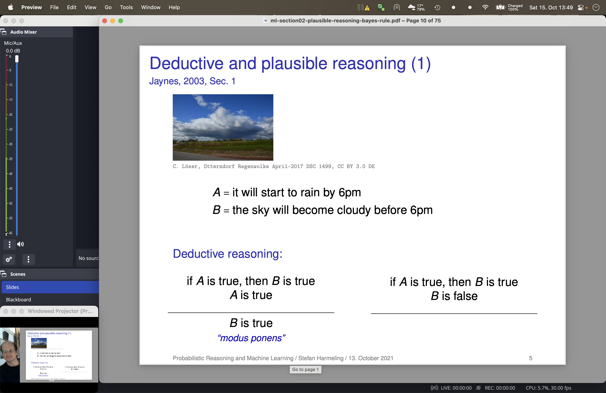

# How to record lectures with minimal after-edits
(author: Stefan Harmeling, created: 2022-10-15, license: CC BY-SA 4.0)

After dozons of the recorded lectures, let's again see how I do it right now.

## TLDR / useful software
* OBS (for arranging scenes and recording)

That's it!  Of course we need some presentation software such as:
* Preview (for PDF)
* Powerpoint
* Keynote
* Firefox

## Setup for OBS
Keeping it simple is good to be able to handle it during the lecture, where your mind load is on the content and not the setup.  Mirror the laptop screen to the projector, then you always know where your pointer is and everything gets easier.

Just define two scenes in OBS:
* "Slides" (for everything, including Firefox)
* "Blackboard" (for pure camera image)

Use only one camehow the image full screen on both scenes.  Additionally for the "Slides" scene show some large crop of the laptop screen where the slides or other content are.

Use:
* only one camera, either the build-in or an external one like the IPEVO
* show the camera image full screen on both scenes, on "slides" as the background to fill up the left hand side.  that's where you should be visible while giving the talk
* the "Slides" scene show some large crop of the laptop screen where the slides or other content are.
* put OBS to extend over the full screen.
* show the microphone pegel on the left (outside the crop)
* OBS STudio --> Tools --> Automatic Scene Switcher to switch back to "Blackboard" once choosing OBS and switching to "Slides" once going to Firefox or Preview.
* Use a "Windowed Projector" in the bottom left (outside the crop).   It can be activated by right clicking into the big preview of OBS (anywhere else?).
* bonus: exclude the status line from the crop and show it all the time
* set the microphone as a "global audio device" in the OBS settings

Possibly in different rooms the projectors have different resolution so there must be some adjustment.  Create for each room a new "scene collection" named after the room and edit it.

Note the OBS "profile" stores the settings of OBS.

There is an example screen shot included.

